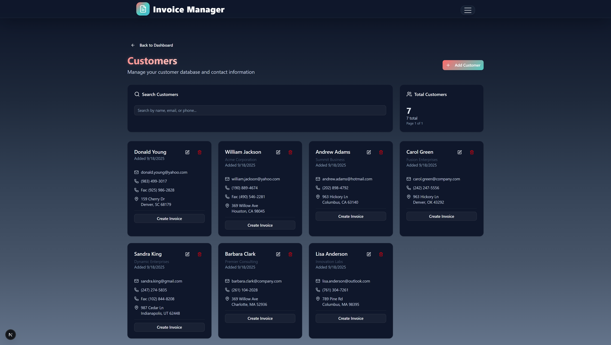

# 🧾 Enterprise Invoice Management System

A comprehensive, production-ready invoice management platform built with cutting-edge technologies. Designed for businesses, freelancers, and enterprises who demand professional invoicing, advanced analytics, and seamless user experience.


## ✨ Key Features

### 🎨 Modern UI/UX Design

- **Glassmorphism Interface**: Cutting-edge glassmorphism effects with gradient themes
- **Intelligent Theme System**: Seamless dark/light mode switching with system preference detection
- **Mobile-First Responsive**: Fully responsive design optimized for all devices
- **Micro-Animations**: Smooth Framer Motion animations and transitions
- **Accessibility Compliant**: WCAG 2.1 AA compliant design with keyboard navigation

### 📊 Advanced Business Intelligence

- **Real-time Executive Dashboard**: Comprehensive business metrics with live data updates
- **Financial Analytics**: Advanced invoice statistics, revenue trends, and payment tracking
- **Customer Insights**: Detailed customer analytics and relationship management
- **Interactive Data Visualization**: Beautiful charts using Chart.js for business performance
- **Performance Metrics**: Track invoice conversion rates and customer satisfaction

### 🧾 Professional Invoice Management

- **Intelligent Invoice Builder**: Advanced invoice creation with auto-save and validation
- **Premium Template Library**: 5 professionally designed templates with customizable branding
- **Smart PDF Generation**: High-quality PDF exports with template-specific styling
- **Live Template Preview**: Real-time preview system showing exact invoice appearance
- **Advanced Calculations**: Intelligent tax calculations and automatic total computation
- **Comprehensive Status Tracking**: Complete invoice lifecycle management

### 👥 Advanced Customer Management

- **Comprehensive Customer Database**: Centralized customer information management
- **Intelligent Customer Selection**: Smart dropdown with search and recent customers
- **Advanced Search & Filtering**: Powerful search capabilities with multiple filters
- **Customer Analytics Dashboard**: Complete invoice history and payment patterns
- **Bulk Operations Management**: Efficient mass operations for customer updates

### 🔐 Enterprise-Grade Security

- **Advanced Authentication**: Secure multi-factor authentication with NextAuth.js
- **Complete Data Isolation**: Multi-tenant architecture ensuring data separation
- **Military-Grade Encryption**: End-to-end encryption for all data transmission
- **Intelligent Session Management**: Secure session handling with automatic refresh
- **Comprehensive Access Control**: Role-based access control with protected routes

## 🛠️ Technology Stack

### Frontend

- **Next.js 15**: Latest React framework with App Router and Server Components
- **React 18**: Modern React with Concurrent Features and Suspense
- **TypeScript**: Full type safety with advanced type inference
- **Tailwind CSS**: Utility-first CSS framework with custom design system
- **shadcn/ui**: Modern component library with accessibility-first design
- **Framer Motion**: Production-ready motion library with gesture support

### Backend & Database

- **MongoDB Atlas**: Cloud-native database with automatic scaling
- **Mongoose**: Elegant MongoDB object modeling with schema validation
- **NextAuth.js**: Complete authentication solution with OAuth providers
- **API Routes**: Serverless API endpoints with built-in rate limiting

### Performance & UX

- **Lucide React**: Beautiful, customizable SVG icons
- **Sonner**: Toast notifications with customizable themes
- **jsPDF**: Client-side PDF generation with advanced formatting
- **Chart.js**: Interactive data visualization for analytics

## 🚀 Quick Start

### Prerequisites

- Node.js 18+
- MongoDB Atlas account
- Git

### Installation

1. **Clone the repository**

   ```bash
   git clone https://github.com/sran4/invoice-manager.git
   cd invoice-manager
   ```

2. **Install dependencies**

   ```bash
   npm install
   ```

3. **Set up environment variables**
   Create a `.env.local` file in the root directory:

   ```env
   MONGODB_URI=your_mongodb_atlas_connection_string
   NEXTAUTH_URL=http://localhost:3000
   NEXTAUTH_SECRET=your_super_secret_key
   NEXT_PUBLIC_APP_NAME=Invoice Manager
   NEXT_PUBLIC_APP_URL=http://localhost:3000
   ```

4. **Run the development server**

   ```bash
   npm run dev
   ```

5. **Open your browser**
   Navigate to [http://localhost:3000](http://localhost:3000)

## 🗄️ Database Setup

### MongoDB Atlas Configuration

1. **Create a MongoDB Atlas cluster**

   - Go to [MongoDB Atlas](https://www.mongodb.com/atlas)
   - Create a free cluster
   - Get your connection string

2. **Set up database user**

   - Create a database user with read/write permissions
   - Whitelist your IP address (or use 0.0.0.0/0 for development)

3. **Update environment variables**
   - Add your MongoDB connection string to `.env.local`

## 📱 Screenshots

### Dashboard


### Invoice Creation


### Customer Management



### Analytics


## 🚀 Deployment

### Vercel (Recommended)

1. **Connect to Vercel**

   - Go to [vercel.com](https://vercel.com)
   - Import your GitHub repository

2. **Add environment variables**

   - Add all variables from your `.env.local` file

3. **Deploy**
   - Click deploy and your app will be live!

### Other Platforms

- **Netlify**: Works with Next.js static export
- **Railway**: Great for full-stack apps
- **DigitalOcean**: VPS deployment option

## 📁 Project Structure

```
invoice-manager/
├── src/
│   ├── app/                    # Next.js app router pages
│   │   ├── api/               # API routes
│   │   ├── auth/              # Authentication pages
│   │   ├── dashboard/         # Dashboard page
│   │   ├── invoices/          # Invoice management
│   │   ├── customers/         # Customer management
│   │   ├── templates/         # Template selection
│   │   └── settings/          # Settings page
│   ├── components/            # Reusable components
│   │   ├── ui/               # shadcn/ui components
│   │   └── layout/           # Layout components
│   ├── contexts/             # React contexts
│   ├── lib/                  # Utility functions
│   │   ├── pdf-export.ts     # PDF generation utilities
│   │   └── company-settings.ts # Company settings management
│   └── types/                # TypeScript type definitions
├── public/                   # Static assets
├── docs/                     # Documentation and images
└── scripts/                  # Database seeding scripts
```

## 🎨 Customization

### Themes

The app supports three themes:

- **Light**: Clean, bright interface
- **Dark**: Dark mode with beautiful gradients
- **Auto**: Automatically switches based on system preference

### Templates

Choose from 5 professional templates:

- **Modern Blue**: Clean and professional with blue gradients
- **Classic Green**: Traditional business layout
- **Minimal Purple**: Simple and elegant design
- **Professional Gray**: Corporate-style template
- **Creative Orange**: Vibrant and creative design

## 🤝 Contributing

Contributions are welcome! Please feel free to submit a Pull Request.

1. Fork the repository
2. Create your feature branch (`git checkout -b feature/AmazingFeature`)
3. Commit your changes (`git commit -m 'Add some AmazingFeature'`)
4. Push to the branch (`git push origin feature/AmazingFeature`)
5. Open a Pull Request

## 📝 License

This project is licensed under the MIT License - see the [LICENSE](LICENSE) file for details.

## 🙏 Acknowledgments

- [Next.js](https://nextjs.org/) - The React framework
- [Tailwind CSS](https://tailwindcss.com/) - Utility-first CSS framework
- [shadcn/ui](https://ui.shadcn.com/) - Beautiful UI components
- [Framer Motion](https://www.framer.com/motion/) - Animation library
- [MongoDB](https://www.mongodb.com/) - Database
- [NextAuth.js](https://next-auth.js.org/) - Authentication

## 📞 Support

If you have any questions or need help, please:

- Open an issue on GitHub
- Check the documentation
- Contact the maintainers

---

**Made with ❤️ by [Satwant S Sran](https://github.com/sran4)**

⭐ **Star this repository if you found it helpful!**
